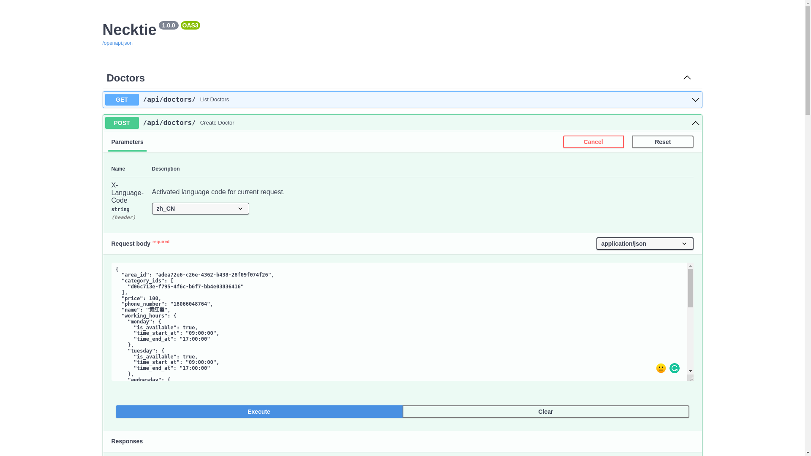
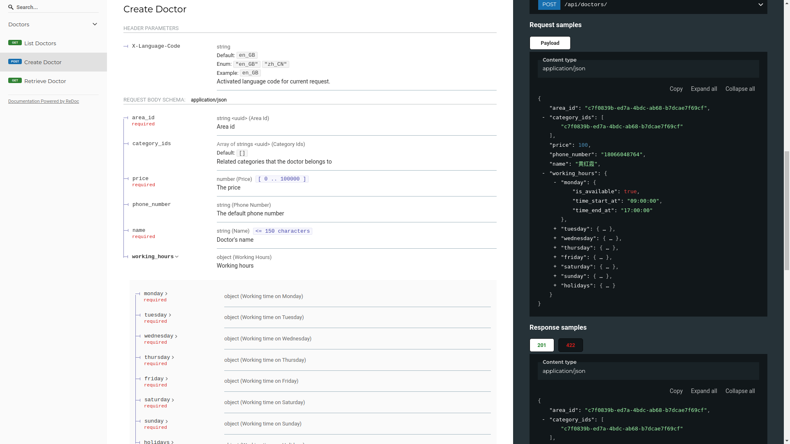
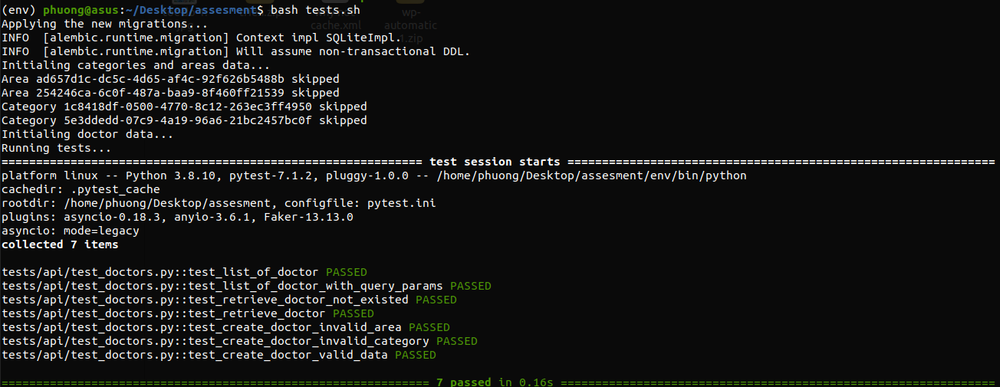

# 1. Summary
**What do we have for this home assesment:**
- Supported multiple language from the model to the API for doctors, areas, categories
- Fully async API framework (FastAPI)
- Typing is applied for 90% of code.
- API test is applied for all endpoints.
- API document (redoc) and Swagger UI area ready to use and will be updated on the go. API schema is compatible with openapi.
- Initial data of are, doctor, category have been seeded.
- Good development tools to keep the high quantity of coding convention (pre-commit, isort, black, flake, mypy..)

### Project structure:
Primary modules and files in this project
```sh
├── api                
│   └── endpoints      # The api endpoints
├── core               # Contains config and core module
├── docs               
├── migrations
│   └── versions       
├── models             # Models will be define here
├── schemas            # Define the schema for data serializers
├── scripts 
└── tests
    └── api            # Test for API endpoint
├── tests.sh           # Bash script to run the test
└── main.py            # The file where we start the app 
```

# 2. Q&A
### Why did you choose this framework?
I have been working with FastAPI since 2 years ago. Initially, the project was not fully supported async as i expected (I/O was blocked by sqlachemy). Recently, sqlachemy supports async engine/connection. So on this occasion, I also want to build a template with FastAPI + sqachemy that fully supports async.

#### The benefits:
- Performance:
  - Unlike Django REST which is built for web purposes, FastAPI is built for API and does not contain unnecessary stuff like sessions, admin, web middlewares...
  - It fully supports async endpoints, so the performance is better than other frameworks.
- Flexible: We don't need to stick with an ORM or code layout like Django. It's a perfect fit to build the microservices
- Typing: Save the time with the suggestions, prevent a lot of runtime errors, and really good if we want to refactor the code without new BUUGGGSSSS.
- Ready-to-use documents, compatible with openapi, good support for websocket.
- I'm familiar with it.

#### The drawbacks:
- Need to build some API stuff (paging, filtering),  from scratch.

###  What are the assumptions underlying that choice?
Assuming the Necktie project structure is something like this:
- Some API backend (Only API).
- Some API consumers: iOS and/or Android app, Doctor backend where the doctors can update their data.
The API backend becomes a bottleneck when the amount of users increases, so it needs to be a good performance point.

### What kind of improvements you would like to implement if you have given more time.
- More helper: auto filtering the result, for now I'm manually filter the Doctor result based on the assessment requirements.
- 100% typing and test coverage, more test tools (keep db state, rollback db state).


### Any extra steps should be taken with caution when deploying your app to a production environment?
- Change the database driver to mysql or postgresql, now I'm using sqlite to have a simple setup step, it's not good for high
traffic API endpoint.
- Next one depends on where we want to deploy it.
   - Need to build a docker image if we intend to use AWS Elastic container or Kubernetes.
   - Need to create a Procfile if we intend to use AWS Elastic beanstalk.

### Any assumptions you have made when you designed the data model and API schema?
I assuming that we'll have a frontend that support multiple languages or the product will be available on many countries. We only show the data that is available for that country.
For example:
- My current language code is zh_CN, i'm looking for the doctors that are available for my country.
- In the initial, Mr Mike is a doctor that only available for en_GB, so I could not see Mr Mike on the result.
- Once someone in the backend add a translation of zh_CN for Mr Mike, he will available on my search result.

Based on the UI, here's the models and relationships:
- [Ares (Office, link to an address)](https://github.com/phuong/Phuong_Vu_Backend_Engineer_Technical_Assessment/blob/66cd15e430b01abffb454bc6840d80dcee79a3cc/models/__init__.py#L20)
- [Categories](https://github.com/phuong/Phuong_Vu_Backend_Engineer_Technical_Assessment/blob/66cd15e430b01abffb454bc6840d80dcee79a3cc/models/__init__.py#L41).
- [Doctors](https://github.com/phuong/Phuong_Vu_Backend_Engineer_Technical_Assessment/blob/66cd15e430b01abffb454bc6840d80dcee79a3cc/models/__init__.py#L59).
- A doctor is belong to one area.
- [A doctor is belong to many categories](https://github.com/phuong/Phuong_Vu_Backend_Engineer_Technical_Assessment/blob/66cd15e430b01abffb454bc6840d80dcee79a3cc/models/__init__.py#L103).

Because we also support multiple languages, so each model which needs to translate will have
it own model_translation table.


# 3. Time to try
Required environment:
- python >=3.6
- virtual environment

### Create a virtual environment

```sh
# For me i'm using virtualenv
virtualenv -p python3 env
source env/bin/activate
```

### Install python packages
Since this is a simple project, i will not separate to dev and prod requirements
```sh
pip install -r requirements.txt
```

### Create database, run the migration
This step will apply the migrations, seed initial areas, categories and create random doctor data.
```sh
alembic upgrade heads
python scripts/initial.py
```

### Start the server
```sh
uvicorn main:app --reload --port 8006 --host 0.0.0.0
```
Once it done, you can access to one of the following urls:
- API Base: http://localhost:8006/
- API swagger: http://localhost:8006/docs
- API document (redoc format): http://localhost:8006/redoc

### Run test

This test runner will help create a test data, apply the migration, seed data and run test with pytest.
```sh
bash tests.sh
```

# 4. The results
### Swagger API document:


### Redoc API document:


### Test result:

